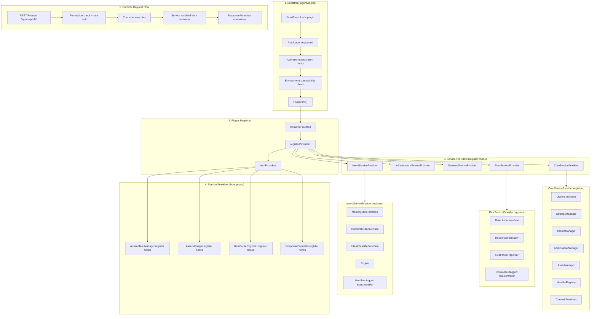
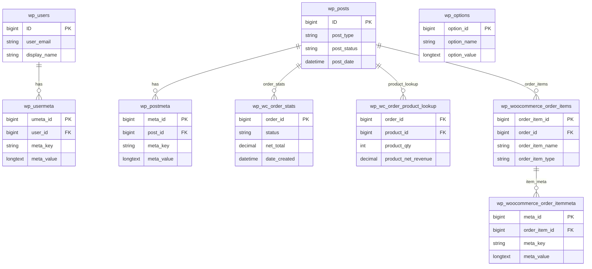
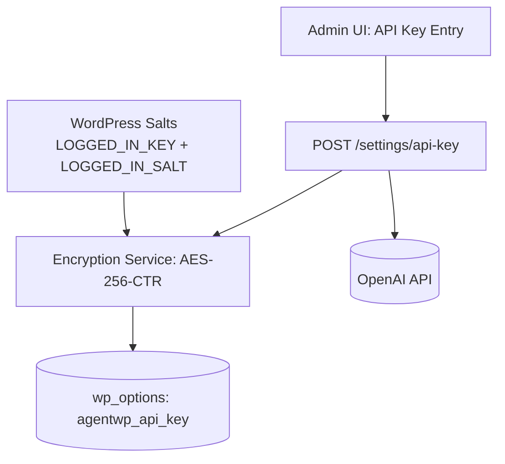
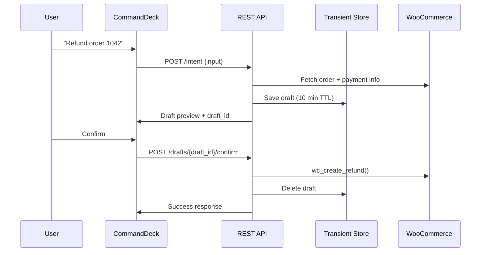
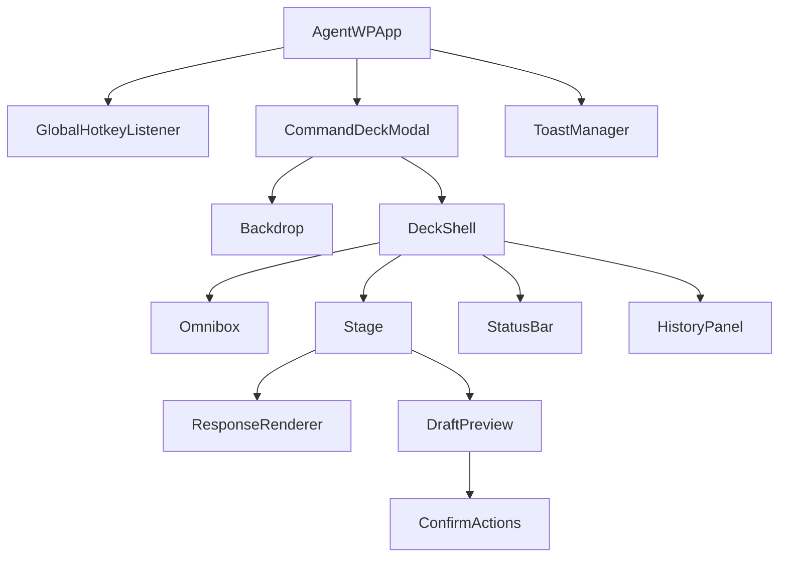

# AgentWP Technical Architecture

## 1) System Overview

### Boot/Composition Flow

AgentWP follows a service provider pattern for composition, with a clear bootstrap sequence. A new contributor can trace the runtime wiring from entry point to request handling by following this flow:



#### Bootstrap Sequence (Step-by-Step)

1. **Entry Point** (`agentwp.php`):
   - Defines constants (`AGENTWP_VERSION`, `AGENTWP_PLUGIN_DIR`, etc.)
   - Registers PSR-4 autoloader (Composer or fallback)
   - Registers activation/deactivation hooks
   - On `plugins_loaded`, checks environment compatibility and calls `Plugin::init()`

2. **Plugin Initialization** (`src/Plugin.php`):
   - Creates singleton instance
   - Instantiates DI container (`src/Container/Container.php`)
   - Calls `registerProviders()` then `bootProviders()`
   - Fires `agentwp_register_providers` and `agentwp_boot_providers` actions for extensions

3. **Provider Registration** (register phase):
   - Each provider registers services as singletons/bindings in the container
   - Services are tagged for collection (e.g., `intent.handler`, `rest.controller`)
   - No side effects—only container configuration

4. **Provider Boot** (boot phase):
   - `CoreServiceProvider`: Registers admin menu and asset hooks via managers
   - `RestServiceProvider`: Registers REST route and response formatter hooks
   - Side effects occur (WordPress hooks added)

5. **Runtime Request** (e.g., `POST /wp-json/agentwp/v1/intent`):
   - `RestRouteRegistrar` triggers controller route registration on `rest_api_init`
   - Controller resolves dependencies from container (see [ADR 0001](adr/0001-rest-controller-dependency-resolution.md))
   - Handler executes with injected services
   - `ResponseFormatter` normalizes response envelope on `rest_post_dispatch`

### Key Composition Components

| Component | Location | Purpose |
|-----------|----------|---------|
| Container | `src/Container/Container.php` | PSR-11 style DI container |
| ServiceProvider | `src/Container/ServiceProvider.php` | Base class for providers |
| RestRouteRegistrar | `src/Plugin/RestRouteRegistrar.php` | Collects and registers controllers |
| ResponseFormatter | `src/Plugin/ResponseFormatter.php` | Normalizes REST responses |
| SettingsManager | `src/Plugin/SettingsManager.php` | Centralized settings access |

### Architecture Decision Records

The following ADRs document key architectural decisions:

- **[ADR 0001: REST Controller Dependency Resolution](adr/0001-rest-controller-dependency-resolution.md)** — Controllers resolve dependencies via container, not direct instantiation
- **[ADR 0002: Intent Handler Registration](adr/0002-intent-handler-registration.md)** — `#[HandlesIntent]` attributes and container tagging for handler discovery
- **[ADR 0003: Intent Classification Strategy](adr/0003-intent-classification-strategy.md)** — `ScorerRegistry` as the canonical classifier with pluggable scorers
- **[ADR 0004: OpenAI Client Architecture](adr/0004-openai-client-architecture.md)** — Monolithic client with infrastructure abstractions for HTTP/retry
- **[ADR 0005: REST Rate Limiting](adr/0005-rest-rate-limiting.md)** — Injected `RateLimiterInterface` for testable rate limiting

For the improvement roadmap, see [ARCHITECTURE-IMPROVEMENT-PLAN.md](ARCHITECTURE-IMPROVEMENT-PLAN.md).

---

AgentWP is a WordPress plugin that provides a React-powered admin UI (Command Deck) and a PHP backend that integrates with WooCommerce and the OpenAI API. The plugin exposes REST endpoints under `/wp-json/agentwp/v1` and uses standard WooCommerce tables plus `wp_options` for settings and encrypted BYOK storage.

```mermaid
flowchart LR
  subgraph WP[WordPress + WooCommerce]
    WPCore[WordPress Core]
    WC[WooCommerce]
    DB[(MySQL: wp_* tables)]
    WPCore --> WC
    WPCore --> DB
    WC --> DB
  end

  subgraph AgentWP[AgentWP Plugin]
    PHP[PHP Backend (AgentWP\*)]
    REST[REST API /wp-json/agentwp/v1/*]
    React[React Command Deck]
    Assets[Assets: JS/CSS]
    PHP --> REST
    REST --> PHP
    React --> REST
    Assets --> React
  end

  OpenAI[(OpenAI API)]

  WPCore --> AgentWP
  AgentWP --> DB
  PHP --> OpenAI
  OpenAI --> PHP
```

### Plugin Structure (target layout)
- `agentwp.php`: Main plugin bootstrap, activation/deactivation hooks.
- `src/`: PHP classes (namespaced `AgentWP\*`).
- `assets/`: Built JS/CSS for the Command Deck.
- `react/`: React source for the Command Deck UI.
- `includes/`: Legacy compatibility and helper files.
- `languages/`: i18n files.

## 2) Database Schema (No Custom Tables)

AgentWP uses WooCommerce and WordPress core tables plus `wp_options` for settings and encrypted API keys. Transients are stored in `wp_options` via the WordPress transient API.



### Settings and Storage Rules
- Settings and encrypted BYOK are stored in `wp_options`.
- Example keys:
  - `agentwp_api_key` (encrypted)
  - `agentwp_settings` (JSON)
  - `agentwp_budget_limit` (numeric)
- Drafts are stored in transients (e.g., `agentwp_draft_{id}`) with short TTLs.
- No custom tables are introduced for core features.

## 3) REST API Endpoint Specification

Base path: `/wp-json/agentwp/v1`

**Common response envelope**
```json
{
  "success": true,
  "data": {},
  "error": {
    "code": "string",
    "message": "string"
  }
}
```

### POST /intent
Primary AI entry point. Converts user input into actions and/or drafts.

Request schema:
```json
{
  "input": "string",
  "context": {
    "ui_source": "command_deck|api",
    "session_id": "string",
    "draft_id": "string"
  }
}
```

Response schema:
```json
{
  "success": true,
  "data": {
    "message": "string",
    "draft": {
      "id": "string",
      "type": "refund|status_update|stock_update|bulk_action",
      "summary": "string",
      "expires_at": "string"
    },
    "cards": []
  }
}
```

### POST /settings/api-key
Validates and stores a BYOK OpenAI key (encrypted).

Request schema:
```json
{
  "api_key": "sk-..."
}
```

Response schema:
```json
{
  "success": true,
  "data": {
    "stored": true,
    "last4": "string"
  }
}
```

### GET /settings
Returns plugin settings (no secrets).

Response schema:
```json
{
  "success": true,
  "data": {
    "model": "gpt-4o|gpt-4o-mini",
    "budget_limit": 0,
    "draft_ttl_minutes": 10
  }
}
```

### POST /settings
Updates plugin settings.

Request schema:
```json
{
  "model": "gpt-4o|gpt-4o-mini",
  "budget_limit": 0,
  "draft_ttl_minutes": 10
}
```

Response schema:
```json
{
  "success": true,
  "data": {
    "updated": true
  }
}
```

### GET /usage
Returns usage totals and cost.

Request schema (query string):
```
?period=day|week|month
```

Response schema:
```json
{
  "success": true,
  "data": {
    "total_tokens": 0,
    "total_cost_usd": 0,
    "breakdown_by_intent": {},
    "daily_trend": []
  }
}
```

### GET /health
Provides basic service health.

Response schema:
```json
{
  "success": true,
  "data": {
    "status": "ok|degraded|down",
    "time": "string (ISO 8601, UTC)",
    "timestamp": 1700000000000,
    "version": "string"
  }
}
```

### GET /search
Typeahead search across products, orders, customers.

Request schema (query string):
```
?q=string&types=products,orders,customers
```

Response schema:
```json
{
  "success": true,
  "data": {
    "products": [],
    "orders": [],
    "customers": []
  }
}
```

### GET /drafts/{draft_id}
Fetches a pending draft for confirmation UI.

Response schema:
```json
{
  "success": true,
  "data": {
    "id": "string",
    "type": "refund|status_update|stock_update|bulk_action",
    "payload": {},
    "expires_at": "string"
  }
}
```

### POST /drafts/{draft_id}/confirm
Confirms a draft action (refund, status update, stock update, bulk action).

Request schema:
```json
{
  "confirm": true
}
```

Response schema:
```json
{
  "success": true,
  "data": {
    "completed": true,
    "result": {}
  }
}
```

### POST /drafts/{draft_id}/cancel
Cancels a pending draft action.

Request schema:
```json
{
  "reason": "string"
}
```

Response schema:
```json
{
  "success": true,
  "data": {
    "cancelled": true
  }
}
```

### Common API Rules
- Authentication: `current_user_can('manage_woocommerce')` required.
- Rate limiting: 60 requests/minute per user (429 with `Retry-After`).
- Validation: JSON schema enforced for all POST bodies.
- Logging: request metadata stored in transients (24h TTL), no PII.

## 4) Security Architecture (BYOK + AES-256)

AgentWP never stores or logs plaintext API keys. Keys are encrypted at rest using AES-256 and WordPress salts as key material.



### BYOK Handling
- **Key derivation**: Use WordPress salts as input to derive encryption key.
- **Encryption**: AES-256-CTR with random IV per encryption; store IV with ciphertext.
- **Decryption**: Only performed server-side just-in-time for API calls.
- **Rotation**: Re-encrypt on salt change or explicit rotation.
- **Least exposure**: Keys are never rendered in the UI; only masked last-4 is returned.

## 5) Draft-Confirm Data Flow

Draft-Confirm prevents destructive actions without explicit approval. The AI prepares a draft, then the user confirms the action in the UI.



```mermaid
flowchart LR
  Intent[Intent received] --> Draft[Create draft]
  Draft --> Store[Store transient (TTL)]
  Store --> Preview[Return draft_id + preview]
  Preview --> Decision{User decision}
  Decision -->|Confirm| Execute[Execute action]
  Decision -->|Cancel| Cancel[Discard draft]
  Execute --> Result[Return result]
  Cancel --> Result
```

### Draft Payload Example
```json
{
  "id": "draft_123",
  "type": "refund",
  "summary": "Refund $25.00 to order #1042",
  "payload": {
    "order_id": 1042,
    "refund_amount": 25,
    "reason": "Late shipment",
    "restock_items": true
  }
}
```

## 6) React Command Deck Component Hierarchy



### Component Notes
- **Omnibox**: debounced input + submit on Enter, Esc to close.
- **Stage**: renders markdown responses and draft previews.
- **DraftPreview**: shows summary + confirm/cancel actions.
- **StatusBar**: latency, tokens, session cost.
- **HistoryPanel**: recent commands and favorites (local storage).

## 7) Data Flow Summary (End-to-End)
1) Admin invokes Command Deck (hotkey or admin bar).
2) React submits input to `/intent`.
3) PHP backend validates, enriches context (orders, user, store settings).
4) OpenAI response determines intent and produces a draft or answer.
5) Drafts are stored in transients and surfaced in UI.
6) Confirmations are executed via `/drafts/{draft_id}/confirm`.

## 8) Acceptance Criteria Checklist
- Major subsystems documented: UI, REST API, PHP backend, OpenAI integration.
- Mermaid diagrams for system overview, data flow, and component hierarchy.
- REST API endpoints include request/response schemas and common rules.
- Database section uses standard WooCommerce tables and `wp_options` only.
- BYOK security architecture specifies AES-256 encryption and key handling.
