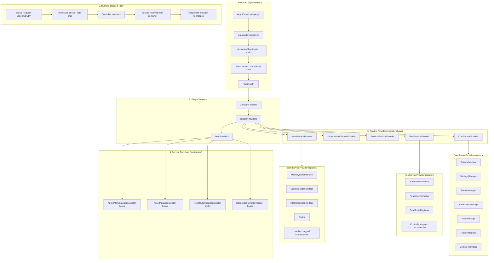
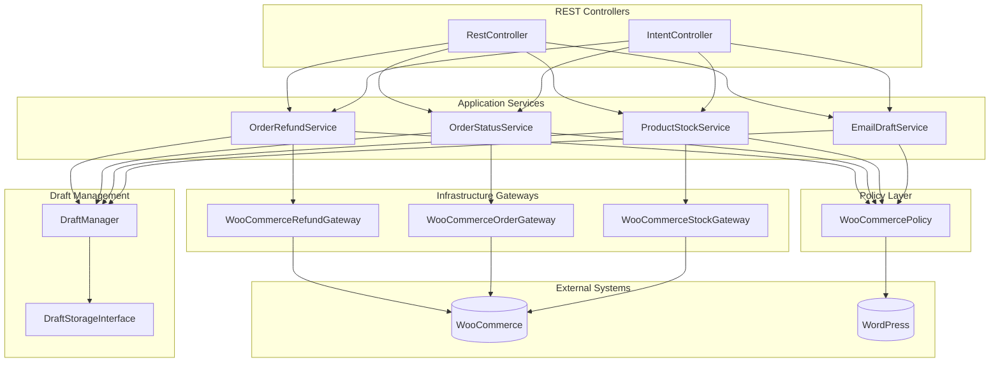
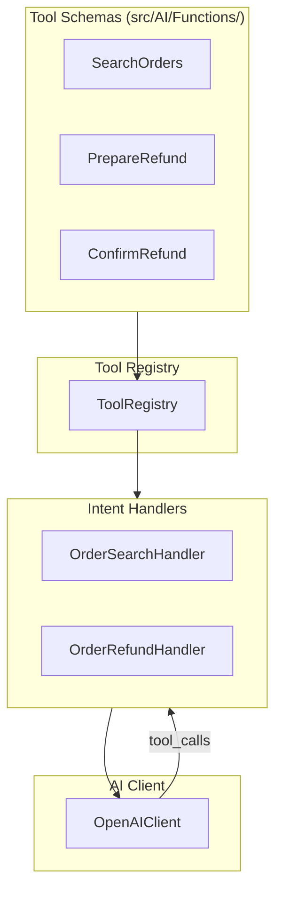
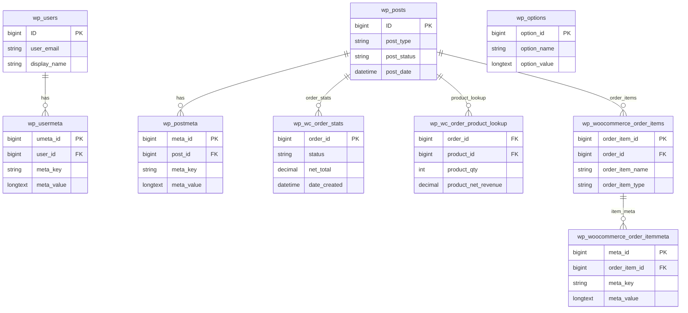
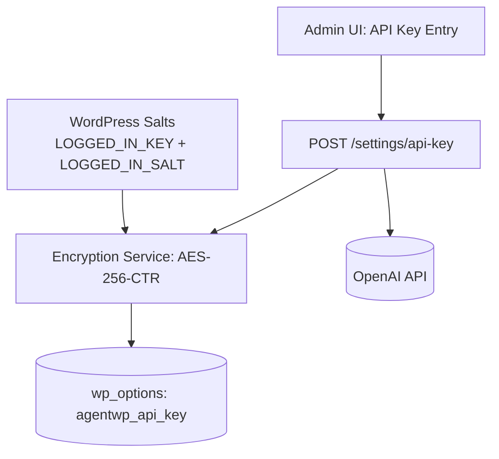
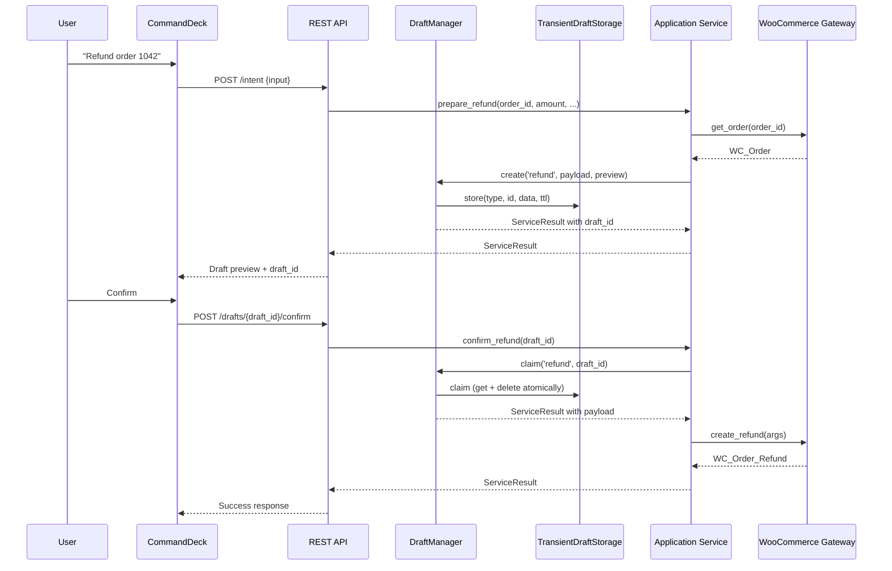
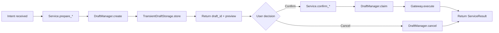
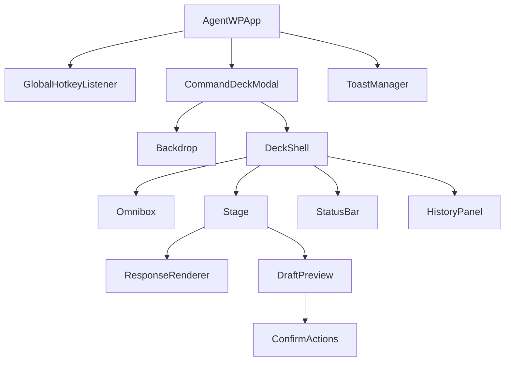

# AgentWP Technical Architecture

## Where Things Live

Quick reference to locate major subsystems:

| Location | Purpose |
|----------|---------|
| `agentwp.php` | Plugin entrypoint: constants, autoloader, activation hooks |
| `src/Plugin.php` | Singleton bootstrap, container creation, provider orchestration |
| `src/Providers/` | Service providers (Core, Infrastructure, Services, Rest, Intent) |
| `src/Rest/` | **Canonical location for REST controllers** (`AgentWP\Rest` namespace). All new controllers must be added here. |
| `src/Intent/` | Intent engine, classifier, handlers (`src/Intent/Handlers/`) |
| `src/Services/` | Domain services (refund, order status, stock, draft management) |
| `src/Infrastructure/` | Gateways, adapters, WooCommerce wrappers, caching |
| `src/Contracts/` | Interfaces defining boundaries for DI and testing |
| `src/DTO/` | Value objects (`ServiceResult`, `DraftPayload`, request DTOs) |
| `src/Container/` | PSR-11 style DI container and base `ServiceProvider` |
| `src/Security/` | Policy layer for capability checks |
| `react/src/` | Command Deck React UI (features, hooks, stores, components) |
| `assets/` | Built JS/CSS bundles for WordPress admin |
| `docs/` | Architecture docs, ADRs, API spec, developer guides |
| `tests/` | PHPUnit tests, integration tests |

For the architecture improvement roadmap, see [ARCHITECTURE-IMPROVEMENT-PLAN.md](ARCHITECTURE-IMPROVEMENT-PLAN.md).

## 1) System Overview

### Boot/Composition Flow

AgentWP follows a service provider pattern for composition, with a clear bootstrap sequence. A new contributor can trace the runtime wiring from entry point to request handling by following this flow:



#### Bootstrap Sequence (Step-by-Step)

1. **Entry Point** (`agentwp.php`):
   - Defines constants (`AGENTWP_VERSION`, `AGENTWP_PLUGIN_DIR`, etc.)
   - Registers PSR-4 autoloader (Composer or fallback)
   - Registers activation/deactivation hooks
   - On `plugins_loaded`, checks environment compatibility and calls `Plugin::init()`

2. **Plugin Initialization** (`src/Plugin.php`):
   - Creates singleton instance
   - Instantiates DI container (`src/Container/Container.php`)
   - Calls `registerProviders()` then `bootProviders()`
   - Fires `agentwp_register_providers` and `agentwp_boot_providers` actions for extensions

3. **Provider Registration** (register phase):
   - Each provider registers services as singletons/bindings in the container
   - Services are tagged for collection (e.g., `intent.handler`, `rest.controller`)
   - No side effects—only container configuration

4. **Provider Boot** (boot phase):
   - `CoreServiceProvider`: Registers admin menu and asset hooks via managers
   - `RestServiceProvider`: Registers REST route and response formatter hooks
   - Side effects occur (WordPress hooks added)

5. **Runtime Request** (e.g., `POST /wp-json/agentwp/v1/intent`):
   - `RestRouteRegistrar` triggers controller route registration on `rest_api_init`
   - Controller resolves dependencies from container (see [ADR 0001](adr/0001-rest-controller-dependency-resolution.md))
   - Handler executes with injected services
   - `ResponseFormatter` normalizes response envelope on `rest_post_dispatch`

### Key Composition Components

| Component | Location | Purpose |
|-----------|----------|---------|
| Container | `src/Container/Container.php` | PSR-11 style DI container |
| ServiceProvider | `src/Container/ServiceProvider.php` | Base class for providers |
| RestRouteRegistrar | `src/Plugin/RestRouteRegistrar.php` | Collects and registers controllers |
| ResponseFormatter | `src/Plugin/ResponseFormatter.php` | Normalizes REST responses |
| SettingsManager | `src/Plugin/SettingsManager.php` | Centralized settings access |

### Architecture Decision Records

The following ADRs document key architectural decisions:

- **[ADR 0001: REST Controller Dependency Resolution](adr/0001-rest-controller-dependency-resolution.md)** — Controllers resolve dependencies via container, not direct instantiation
- **[ADR 0002: Intent Handler Registration](adr/0002-intent-handler-registration.md)** — `#[HandlesIntent]` attributes and container tagging for handler discovery
- **[ADR 0003: Intent Classification Strategy](adr/0003-intent-classification-strategy.md)** — `ScorerRegistry` as the canonical classifier with pluggable scorers
- **[ADR 0004: OpenAI Client Architecture](adr/0004-openai-client-architecture.md)** — Monolithic client with infrastructure abstractions for HTTP/retry
- **[ADR 0005: REST Rate Limiting](adr/0005-rest-rate-limiting.md)** — Injected `RateLimiterInterface` for testable rate limiting
- **[ADR 0006: Search Index Architecture](adr/0006-search-index-architecture.md)** — Static class design for MySQL fulltext search index
- **[ADR 0007: Request DTO Validation](adr/0007-request-dto-validation.md)** — DTO-based request validation
- **[ADR 0008: Tool Execution Architecture](adr/0008-tool-execution-architecture.md)** — Schema classes + handler executors for OpenAI function calling

For the improvement roadmap, see [ARCHITECTURE-IMPROVEMENT-PLAN.md](ARCHITECTURE-IMPROVEMENT-PLAN.md).

For detailed search index documentation including troubleshooting and performance considerations, see [Search Index](search-index.md).

## 1.1) Service Layer Architecture

The service layer follows a clean architecture pattern with clear separation of concerns:



### Policy Layer

The policy layer (`src/Security/Policy/`) centralizes all capability checks, keeping domain services free of direct WordPress function calls:

| Interface | Implementation | Purpose |
|-----------|----------------|---------|
| `PolicyInterface` | `WooCommercePolicy` | Abstracts `current_user_can()` calls |

**Available permission checks:**
- `canManageOrders()` — Manage WooCommerce orders
- `canManageProducts()` — Manage WooCommerce products
- `canRefundOrders()` — Issue refunds
- `canUpdateOrderStatus()` — Update order statuses
- `canManageStock()` — Manage product stock
- `canDraftEmails()` — Draft customer emails

Services inject `PolicyInterface` and delegate capability checks:

```php
public function prepare_refund( int $order_id, ... ): ServiceResult {
    if ( ! $this->policy->canRefundOrders() ) {
        return ServiceResult::permissionDenied();
    }
    // ... proceed with operation
}
```

### ServiceResult Standard

All application services return `ServiceResult` (`src/DTO/ServiceResult.php`), an immutable value object providing uniform outcomes:

```php
// Success with payload
ServiceResult::success( 'Refund processed.', array( 'refund_id' => 123 ) );

// Typed failure constructors
ServiceResult::permissionDenied();                    // 403
ServiceResult::notFound( 'Order', $id );             // 404
ServiceResult::invalidInput( 'Invalid amount.' );   // 400
ServiceResult::invalidState( 'Already refunded.' ); // 409
ServiceResult::draftExpired();                       // 410
ServiceResult::operationFailed( 'Gateway error.' ); // 500
```

**Standard result codes:**
| Code | Constant | HTTP Status |
|------|----------|-------------|
| `success` | `CODE_SUCCESS` | 200 |
| `permission_denied` | `CODE_PERMISSION_DENIED` | 403 |
| `not_found` | `CODE_NOT_FOUND` | 404 |
| `invalid_input` | `CODE_INVALID_INPUT` | 400 |
| `invalid_state` | `CODE_INVALID_STATE` | 409 |
| `draft_expired` | `CODE_DRAFT_EXPIRED` | 410 |
| `operation_failed` | `CODE_OPERATION_FAILED` | 500 |

Controllers map `ServiceResult` to REST responses:

```php
$result = $this->service->prepare_refund( $order_id, $amount );

if ( $result->isFailure() ) {
    return new WP_REST_Response( $result->toArray(), $result->httpStatus );
}

return new WP_REST_Response( array( 'success' => true, 'data' => $result->data ), 200 );
```

### WooCommerce Gateway Abstractions

Services do not call WooCommerce functions directly. Instead, gateway interfaces (`src/Contracts/`) abstract all WooCommerce operations:

| Interface | Implementation | Wraps |
|-----------|----------------|-------|
| `WooCommerceRefundGatewayInterface` | `WooCommerceRefundGateway` | `wc_create_refund()`, `wc_get_order()` |
| `WooCommerceOrderGatewayInterface` | `WooCommerceOrderGateway` | Order status updates |
| `WooCommerceStockGatewayInterface` | `WooCommerceStockGateway` | Stock level updates |
| `WooCommerceUserGatewayInterface` | `WooCommerceUserGateway` | Customer data access |

This abstraction enables:
- **Unit testing** with fakes/mocks (no WooCommerce runtime required)
- **Consistent error handling** across all WooCommerce operations
- **Clear boundaries** between domain logic and infrastructure

## 1.2) Tool Execution Architecture

AgentWP uses OpenAI function calling (tools) to enable AI-driven workflows. The architecture separates tool schemas from execution logic.



### Key Components

| Component | Location | Responsibility |
|-----------|----------|----------------|
| `FunctionSchema` | `src/Contracts/FunctionSchema.php` | Interface for tool schema |
| `AbstractFunction` | `src/AI/Functions/AbstractFunction.php` | Base class with OpenAI format |
| `ToolRegistry` | `src/Intent/ToolRegistry.php` | O(1) schema lookup |
| `ToolExecutorInterface` | `src/Contracts/ToolExecutorInterface.php` | Execution contract |
| `AbstractAgenticHandler` | `src/Intent/Handlers/AbstractAgenticHandler.php` | Agentic loop base |

### Adding a New Tool

1. **Create schema class** in `src/AI/Functions/`:
   ```php
   class MyTool extends AbstractFunction {
       public function get_name(): string { return 'my_tool'; }
       public function get_parameters(): string { /* JSON schema */ }
   }
   ```

2. **Register in IntentServiceProvider**:
   ```php
   $registry->register(new MyTool());
   ```

3. **Declare in handler** via `getToolNames()`:
   ```php
   protected function getToolNames(): array {
       return ['my_tool'];
   }
   ```

4. **Implement execution** in `execute_tool()`:
   ```php
   public function execute_tool(string $name, array $args) {
       return match ($name) {
           'my_tool' => $this->service->doSomething($args),
       };
   }
   ```

See [ADR 0008: Tool Execution Architecture](adr/0008-tool-execution-architecture.md) for detailed rationale and design principles.

---

AgentWP is a WordPress plugin that provides a React-powered admin UI (Command Deck) and a PHP backend that integrates with WooCommerce and the OpenAI API. The plugin exposes REST endpoints under `/wp-json/agentwp/v1` and uses standard WooCommerce tables plus `wp_options` for settings and encrypted BYOK storage.

```mermaid
flowchart LR
  subgraph WP[WordPress + WooCommerce]
    WPCore[WordPress Core]
    WC[WooCommerce]
    DB[(MySQL: wp_* tables)]
    WPCore --> WC
    WPCore --> DB
    WC --> DB
  end

  subgraph AgentWP[AgentWP Plugin]
    PHP[PHP Backend (AgentWP\*)]
    REST[REST API /wp-json/agentwp/v1/*]
    React[React Command Deck]
    Assets[Assets: JS/CSS]
    PHP --> REST
    REST --> PHP
    React --> REST
    Assets --> React
  end

  OpenAI[(OpenAI API)]

  WPCore --> AgentWP
  AgentWP --> DB
  PHP --> OpenAI
  OpenAI --> PHP
```

### Plugin Structure (target layout)
- `agentwp.php`: Main plugin bootstrap, activation/deactivation hooks.
- `src/`: PHP classes (namespaced `AgentWP\*`).
- `assets/`: Built JS/CSS for the Command Deck.
- `react/`: React source for the Command Deck UI.
- `includes/`: Legacy compatibility and helper files.
- `languages/`: i18n files.

## 2) Database Schema (No Custom Tables)

AgentWP uses WooCommerce and WordPress core tables plus `wp_options` for settings and encrypted API keys. Transients are stored in `wp_options` via the WordPress transient API.



### Settings and Storage Rules
- Settings and encrypted BYOK are stored in `wp_options`.
- Example keys:
  - `agentwp_api_key` (encrypted)
  - `agentwp_settings` (JSON)
  - `agentwp_budget_limit` (numeric)
- Drafts are stored in transients (e.g., `agentwp_draft_{id}`) with short TTLs.
- No custom tables are introduced for core features.

## 3) REST API Endpoint Specification

Base path: `/wp-json/agentwp/v1`

**Common response envelope**
```json
{
  "success": true,
  "data": {},
  "error": {
    "code": "string",
    "message": "string"
  }
}
```

### POST /intent
Primary AI entry point. Converts user input into actions and/or drafts.

Request schema:
```json
{
  "input": "string",
  "context": {
    "ui_source": "command_deck|api",
    "session_id": "string",
    "draft_id": "string"
  }
}
```

Response schema:
```json
{
  "success": true,
  "data": {
    "message": "string",
    "draft": {
      "id": "string",
      "type": "refund|status_update|stock_update|bulk_action",
      "summary": "string",
      "expires_at": "string"
    },
    "cards": []
  }
}
```

### POST /settings/api-key
Validates and stores a BYOK OpenAI key (encrypted).

Request schema:
```json
{
  "api_key": "sk-..."
}
```

Response schema:
```json
{
  "success": true,
  "data": {
    "stored": true,
    "last4": "string"
  }
}
```

### GET /settings
Returns plugin settings (no secrets).

Response schema:
```json
{
  "success": true,
  "data": {
    "model": "gpt-4o|gpt-4o-mini",
    "budget_limit": 0,
    "draft_ttl_minutes": 10
  }
}
```

### POST /settings
Updates plugin settings.

Request schema:
```json
{
  "model": "gpt-4o|gpt-4o-mini",
  "budget_limit": 0,
  "draft_ttl_minutes": 10
}
```

Response schema:
```json
{
  "success": true,
  "data": {
    "updated": true
  }
}
```

### GET /usage
Returns usage totals and cost.

Request schema (query string):
```
?period=day|week|month
```

Response schema:
```json
{
  "success": true,
  "data": {
    "total_tokens": 0,
    "total_cost_usd": 0,
    "breakdown_by_intent": {},
    "daily_trend": []
  }
}
```

### GET /health
Provides basic service health.

Response schema:
```json
{
  "success": true,
  "data": {
    "status": "ok|degraded|down",
    "time": "string (ISO 8601, UTC)",
    "timestamp": 1700000000000,
    "version": "string"
  }
}
```

### GET /search
Typeahead search across products, orders, customers.

Request schema (query string):
```
?q=string&types=products,orders,customers
```

Response schema:
```json
{
  "success": true,
  "data": {
    "products": [],
    "orders": [],
    "customers": []
  }
}
```

### GET /drafts/{draft_id}
Fetches a pending draft for confirmation UI.

Response schema:
```json
{
  "success": true,
  "data": {
    "id": "string",
    "type": "refund|status_update|stock_update|bulk_action",
    "payload": {},
    "expires_at": "string"
  }
}
```

### POST /drafts/{draft_id}/confirm
Confirms a draft action (refund, status update, stock update, bulk action).

Request schema:
```json
{
  "confirm": true
}
```

Response schema:
```json
{
  "success": true,
  "data": {
    "completed": true,
    "result": {}
  }
}
```

### POST /drafts/{draft_id}/cancel
Cancels a pending draft action.

Request schema:
```json
{
  "reason": "string"
}
```

Response schema:
```json
{
  "success": true,
  "data": {
    "cancelled": true
  }
}
```

### Common API Rules
- Authentication: `current_user_can('manage_woocommerce')` required.
- Rate limiting: 60 requests/minute per user (429 with `Retry-After`).
- Validation: JSON schema enforced for all POST bodies.
- Logging: request metadata stored in transients (24h TTL), no PII.

## 4) Security Architecture (BYOK + AES-256)

AgentWP never stores or logs plaintext API keys. Keys are encrypted at rest using AES-256 and WordPress salts as key material.



### BYOK Handling
- **Key derivation**: Use WordPress salts as input to derive encryption key.
- **Encryption**: AES-256-CTR with random IV per encryption; store IV with ciphertext.
- **Decryption**: Only performed server-side just-in-time for API calls.
- **Rotation**: Re-encrypt on salt change or explicit rotation.
- **Least exposure**: Keys are never rendered in the UI; only masked last-4 is returned.

## 5) Draft-Confirm Data Flow

Draft-Confirm prevents destructive actions without explicit approval. The AI prepares a draft, then the user confirms the action in the UI.





### Unified Draft Lifecycle

All draft-based flows use `DraftManager` (`src/Services/DraftManager.php`) for consistent:

- **ID generation**: Type-prefixed, 12-character random IDs (e.g., `refund_a1b2c3d4e5f6`)
- **Payload shape**: Standardized `DraftPayload` DTO with `id`, `type`, `payload`, `preview`, `created_at`, `expires_at`
- **TTL handling**: Configurable via `SettingsManager.getDraftTtl()` (default 10 minutes)
- **Claim semantics**: Atomic get-and-delete prevents double-execution
- **Error handling**: Returns `ServiceResult` for uniform outcome handling

**Supported draft types:**
| Type | Service | Description |
|------|---------|-------------|
| `refund` | `OrderRefundService` | Process order refunds |
| `status` | `OrderStatusService` | Update order status |
| `stock` | `ProductStockService` | Adjust product stock levels |

### DraftPayload Structure

The `DraftPayload` DTO (`src/DTO/DraftPayload.php`) provides a consistent payload shape:

```php
final class DraftPayload {
    public readonly string $id;        // Unique draft identifier
    public readonly string $type;      // Draft type (refund, status, stock)
    public readonly array $payload;    // Operation-specific data
    public readonly array $preview;    // Human-readable preview for UI
    public readonly int $createdAt;    // Unix timestamp
    public readonly int $expiresAt;    // Unix timestamp

    public function isExpired( ?int $now = null ): bool;
    public function getRemainingSeconds( ?int $now = null ): int;
}
```

### Draft Payload Example
```json
{
  "id": "refund_a1b2c3d4e5f6",
  "type": "refund",
  "payload": {
    "order_id": 1042,
    "amount": 25.00,
    "reason": "Late shipment",
    "restock_items": true,
    "currency": "USD",
    "customer_name": "John Doe"
  },
  "preview": {
    "summary": "Refund 25.00 USD for Order #1042 (restock items)",
    "order_id": 1042,
    "amount": 25.00,
    "currency": "USD",
    "reason": "Late shipment",
    "restock_items": true,
    "customer_name": "John Doe"
  },
  "created_at": 1700000000,
  "expires_at": 1700000600
}
```

## 6) React Command Deck Component Hierarchy



### Component Notes
- **Omnibox**: debounced input + submit on Enter, Esc to close.
- **Stage**: renders markdown responses and draft previews.
- **DraftPreview**: shows summary + confirm/cancel actions.
- **StatusBar**: latency, tokens, session cost.
- **HistoryPanel**: recent commands and favorites (local storage).

## 7) Data Flow Summary (End-to-End)
1) Admin invokes Command Deck (hotkey or admin bar).
2) React submits input to `/intent`.
3) PHP backend validates, enriches context (orders, user, store settings).
4) OpenAI response determines intent and produces a draft or answer.
5) Drafts are stored in transients and surfaced in UI.
6) Confirmations are executed via `/drafts/{draft_id}/confirm`.

## 8) Acceptance Criteria Checklist
- Major subsystems documented: UI, REST API, PHP backend, OpenAI integration.
- Mermaid diagrams for system overview, data flow, and component hierarchy.
- REST API endpoints include request/response schemas and common rules.
- Database section uses standard WooCommerce tables and `wp_options` only.
- BYOK security architecture specifies AES-256 encryption and key handling.

## 9) Related Documentation

| Document | Purpose |
|----------|---------|
| [DEVELOPER.md](DEVELOPER.md) | Developer guide with extension examples, hook reference, and local setup |
| [ARCHITECTURE-IMPROVEMENT-PLAN.md](ARCHITECTURE-IMPROVEMENT-PLAN.md) | Completed architecture improvement roadmap |
| [CHANGELOG.md](CHANGELOG.md) | Version history and migration guide |
| [openapi.json](openapi.json) | REST API specification |
| [search-index.md](search-index.md) | Search index implementation details |

### Architecture Decision Records

| ADR | Decision |
|-----|----------|
| [ADR 0001](adr/0001-rest-controller-dependency-resolution.md) | REST controllers resolve dependencies via container |
| [ADR 0002](adr/0002-intent-handler-registration.md) | `#[HandlesIntent]` attributes for handler registration |
| [ADR 0003](adr/0003-intent-classification-strategy.md) | `ScorerRegistry` as canonical intent classifier |
| [ADR 0004](adr/0004-openai-client-architecture.md) | Monolithic OpenAI client with infrastructure abstractions |
| [ADR 0005](adr/0005-rest-rate-limiting.md) | Injected `RateLimiterInterface` for rate limiting |
| [ADR 0006](adr/0006-search-index-architecture.md) | Static search index design |
| [ADR 0007](adr/0007-request-dto-validation.md) | DTO-based request validation |
| [ADR 0008](adr/0008-tool-execution-architecture.md) | Schema classes + handler executors for tools |
