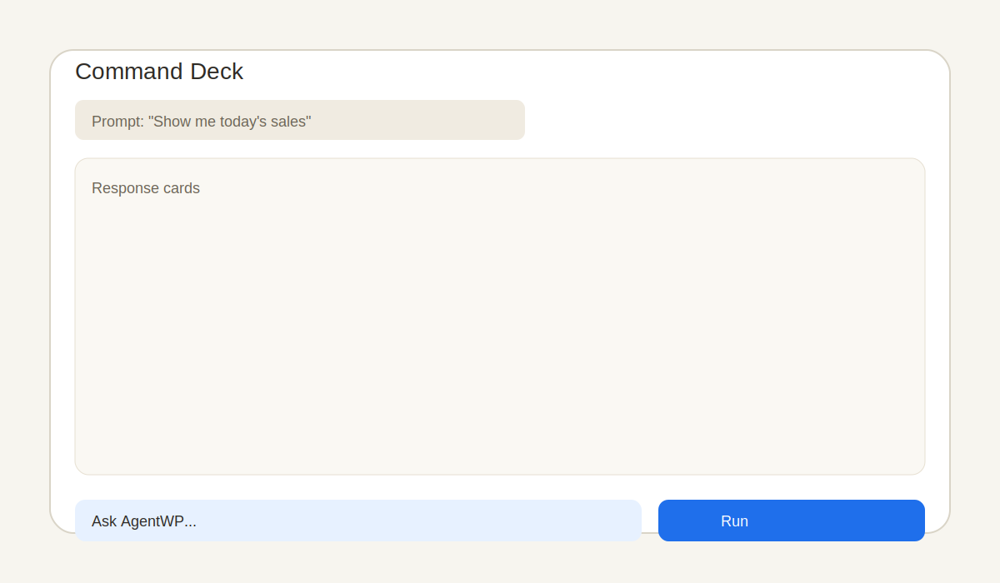
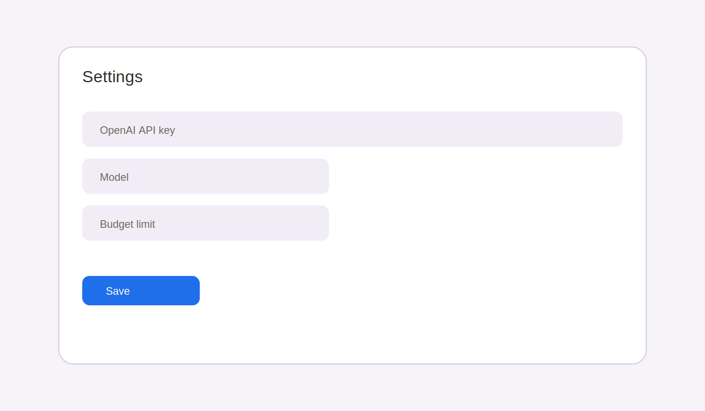
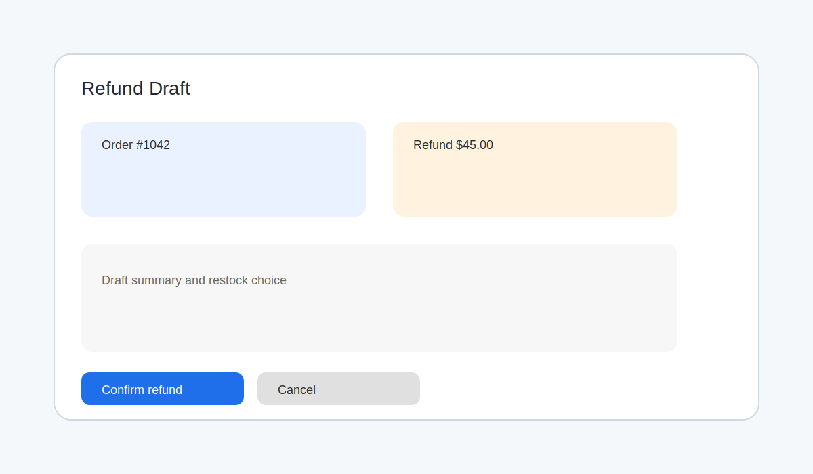
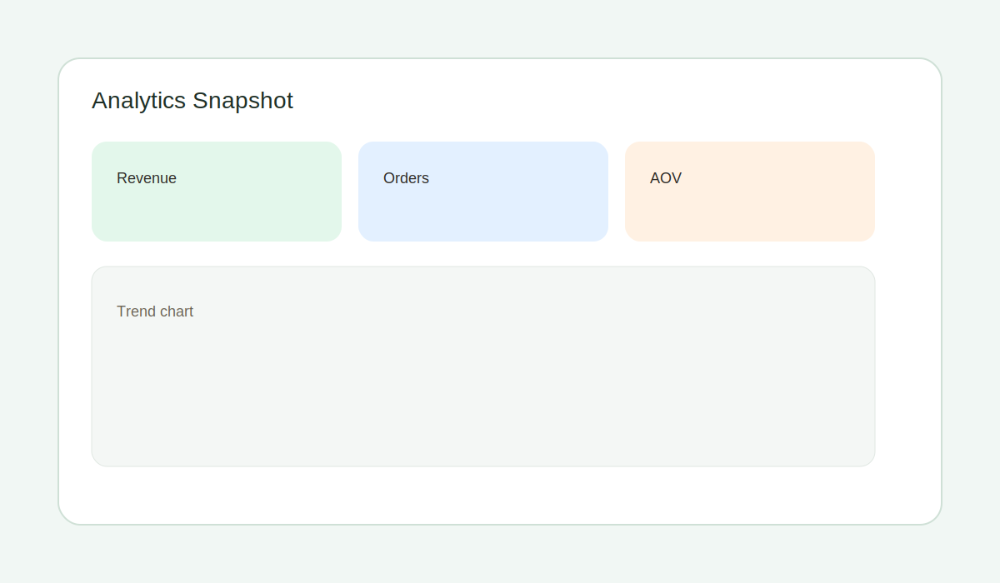
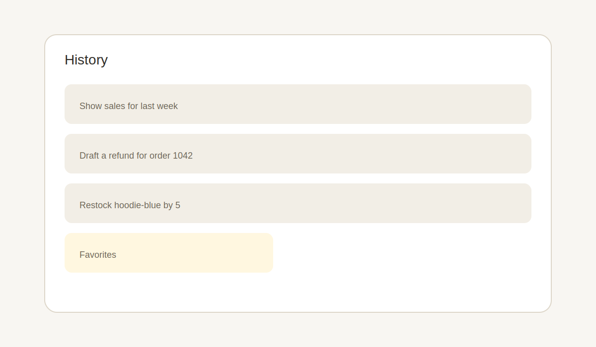

# AgentWP User Guide

AgentWP brings an AI command deck into WooCommerce so you can search orders, draft refunds, and monitor sales with plain-language prompts.

## Quick start
1. Install and activate AgentWP.
2. Go to **WooCommerce > AgentWP**.
3. Open **Settings** and add your OpenAI API key.
4. Run your first prompt from the Command Deck.

## Command Deck basics
The Command Deck is the main surface for AgentWP.
- Type a prompt, press Enter, and review the response cards.
- Draft-based actions (refunds, status updates, stock updates) return a summary and require confirmation.
- Results are saved to History so you can rerun or favorite them.

## Settings and connection
1. Open **WooCommerce > AgentWP**.
2. Click **Settings**.
3. Paste your OpenAI API key and save.
4. Optional: set a budget limit, model, and theme preference.

## Feature walkthrough

### 1) Order search
Ask for orders using natural language.
- Example: "Show orders from Sarah Kim last week"
- Example: "Find unpaid orders over $200"

AgentWP returns matching orders with quick links in the UI.

### 2) Refund preparation and confirmation
Refunds are drafted first, then confirmed.
1. Prompt: "Draft a refund for order 1042 for the damaged item."
2. Review the draft summary (amount, reason, restock choice).
3. Confirm to execute the refund.

### 3) Order status updates
AgentWP supports single or bulk status updates.
- Prompt: "Mark order 1021 as completed"
- Prompt: "Mark last week's pending orders as processing"

You will see a draft list with counts and require confirmation for bulk actions.

### 4) Stock updates
Ask AgentWP to adjust product inventory.
- Prompt: "Reduce stock for SKU hoodie-blue by 3"
- Prompt: "Set stock for product 450 to 25"

Drafts include product identifiers and the new quantity before confirmation.

### 5) Draft customer emails
Use AgentWP to draft customer messages for support workflows.
- Prompt: "Draft a shipping delay email for order 991"
- Prompt: "Write a refund confirmation for order 1050"

You can edit the draft before sending from your usual email workflow.

### 6) Analytics and reports
Ask for summaries, trends, or comparisons.
- Prompt: "Show sales trends for this month"
- Prompt: "Compare last week to this week"

### 7) Customer profiles
AgentWP can summarize customer activity.
- Prompt: "Show profile for customer john@example.com"

You will receive recent order data and lifetime value summaries.

### 8) History and favorites
All commands are logged in History.
- Favorite frequent prompts for one-click reuse.
- Swipe left (touch) to delete an entry.

## Common workflows
- **Refund in two steps:** Draft > review summary > confirm.
- **Weekly check-in:** "Show sales for last week" then "Compare to prior week".
- **Backorder cleanup:** "Find out-of-stock products" then "Restock top sellers by 10".
- **Email follow-up:** "Draft shipping delay email for order 1120".

## Tips and best practices
- Be specific with identifiers (order number, SKU, email).
- Use timeframes like "last week" or explicit dates.
- Set a budget limit if multiple team members use AgentWP.
- Favorite your most-used commands for faster workflows.

## Need help?
See `docs/FAQ.md` for troubleshooting and `docs/API.md` for REST usage.
